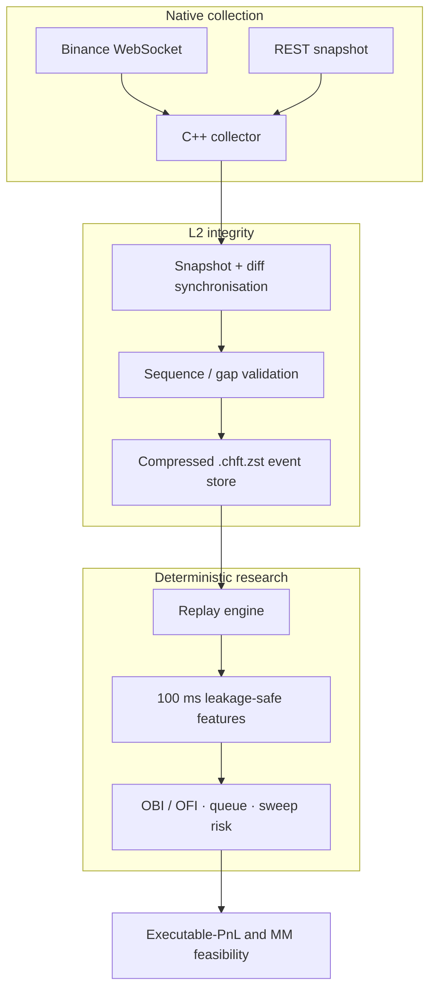
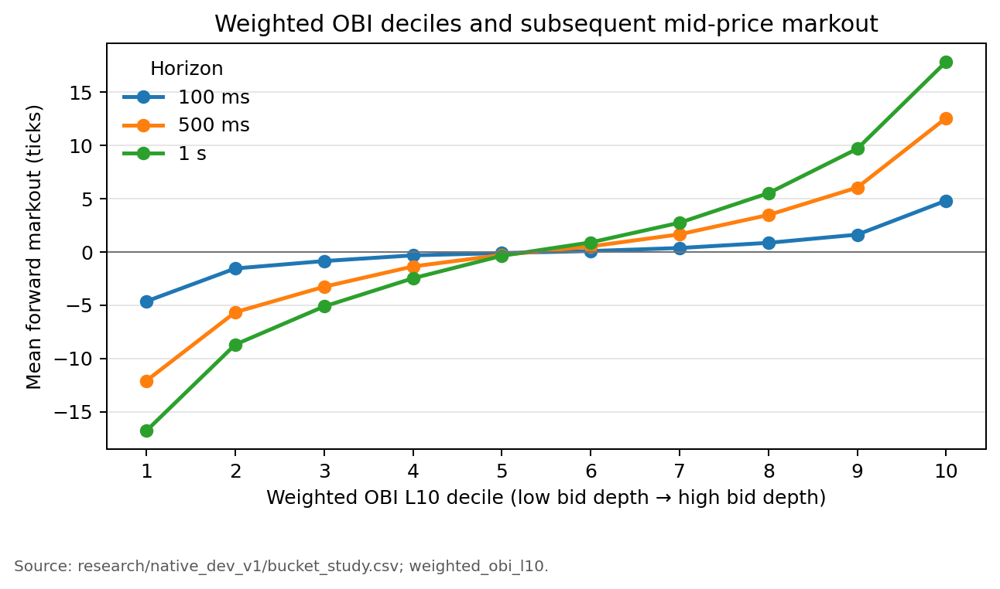
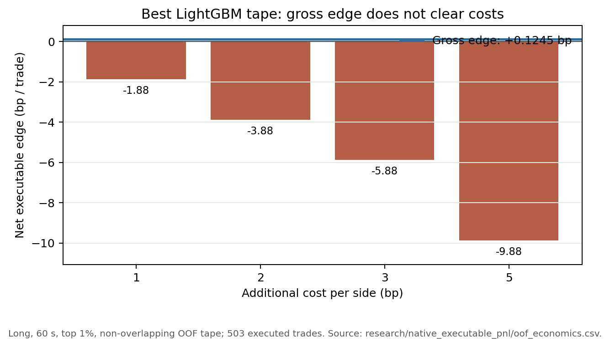

# C++ Crypto Market Microstructure & Market-Making Research

An event-driven C++20 system for collecting and replaying native crypto market data, reconstructing
Binance L2 order books, and studying short-horizon execution economics. BTCUSDT perpetual depth and
`aggTrade` events are self-collected on AWS, stored in a compressed native format, and replayed
deterministically for leakage-safe microstructure research.

## Highlights

- **C++20 native infrastructure:** WebSocket collection, REST snapshot bootstrap, L2 synchronization,
  sequence-gap recovery, integer tick/lot books, compressed storage, and deterministic replay.
- **Self-collected AWS corpus:** six closed Binance BTCUSDT L2 captures with **~123 hours** of
  synchronized development data passing sequence and book-state QC.
- **Leakage-safe features:** OBI, OFI proxies, microprice, L1–L10 depth, trade flow, volatility,
  activity, and sweep-risk features on a 100 ms grid.
- **Execution-aware validation:** queue/fill sensitivity, adverse-selection analysis, blocked OOF
  validation, and non-overlapping executable trade tapes.
- **Main finding:** short-horizon order-book predictability persists out of sample, but the
  executable edge does not overcome the tested execution costs as a standalone strategy.

## System overview



## Data and microstructure research

The collector combines depth updates, aggressive trades, and REST snapshots. A local book is used
only while synchronization is valid; gaps invalidate it until recovery. Research features use only
information available at each decision timestamp.

$$
OBI_t =
\frac{Q_t^{bid} - Q_t^{ask}}
     {Q_t^{bid} + Q_t^{ask}}
$$



Higher weighted-OBI deciles align with increasingly positive subsequent mid-price markouts across
the available 100 ms, 500 ms, and 1 s horizons. Passive market-making work then applies explicit
queue-ahead and removal-credit sensitivity, because aggregated public L2 cannot reveal an account's
exact FIFO rank and fills can be adversely selected.

## Executable-PnL validation

The final test predicts executable bid/ask returns rather than simple direction. It compares OBI-only,
linear, and fixed-specification LightGBM models using chronological blocked OOF validation, then
evaluates selected signals as non-overlapping trades with additional costs of 1–5 bp per side.

| Metric | Result |
| --- | ---: |
| Horizon / selection | 60 s / top 1% |
| Trades | 503 |
| Gross executable edge | **+0.1245 bp/trade** |
| Net edge at 5 bp per side | **−9.8755 bp/trade** |



The order book contains statistically useful short-horizon information, but the measured edge is
not economically viable as a standalone strategy under the tested execution costs. The
`2026-08-23` capture remained deliberately unopened after the predefined OOS gate failed.

## Repository structure

```text
cpp/          C++ collection, order book, storage, replay, and exporters
pyresearch/   Python research and orchestration
research/     Frozen evidence, manifests, reports, and archived studies
docs/         Architecture, methodology, results, and figures
scripts/      Reproducible research entry points
tests/        C++ and Python validation
```

## Build and test

```bash
cmake -S cpp -B build/cpp -DCMAKE_BUILD_TYPE=RelWithDebInfo
cmake --build build/cpp --parallel
ctest --test-dir build/cpp --output-on-failure
python3 -m unittest discover -s tests
```

## Limitations

- Binance public depth is aggregated L2, so exact historical FIFO queue rank is unavailable.
- High-frequency rows represent fewer independent market regimes than their row count suggests.
- Historical replay cannot reproduce account-specific queue position or live latency exactly.

Raw `.chft.zst` captures and large derived datasets are excluded from Git. Detailed frozen evidence,
methodology, and archived studies are indexed in [research/README.md](research/README.md).
